<div align="center">


<h1>Enterprise Scaffolder</h1>

<p><strong>The Institutional-Grade Platform for Standardized Project Scaffolding, Software Factory Governance, and Multi-Stack Engineering Orchestration.</strong></p>

[]()
[]()
[]()

<br/>

> **"Industrializing software creation to automate golden-path foundations."** 
> **Enterprise Scaffolder (ES)** is an enterprise-grade platform designed to provide a secure, measurable, and highly automated foundation for global engineering operations. It orchestrates the complex lifecycle of projects—from template definition and metadata ingestion to policy-driven scaffolding and unified factory auditing.

</div>

---

## 🏛️ Executive Summary

Fragmented project silos and manual boilerplate workflows are strategic operational liabilities; lack of centralized scaffolding orchestration is a primary barrier to organizational cloud maturity. Organizations fail to maintain a secure engineering foundation not because of a lack of code, but because of fragmented scaffolding standards, lack of automated guardrail validation, and an inability to orchestrate project planes with operational precision.

This platform provides the **Project Intelligence Plane**. It implements a complete **Enterprise Scaffolder-as-Code Framework**, enabling Platform and Engineering teams to manage global project foundations as first-class citizens. By automating the identification of boilerplate bottlenecks through real-time telemetry analysis and orchestrating the deployment of secure performance-driven scaffolding policies, we ensure that every organizational service—from core microservices stacks to distributed edge applications—is governed by default, audited for history, and strictly aligned with institutional engineering frameworks.

---

## 📐 Architecture Storytelling: Principal Reference Models

### 1. Principal Architecture: Global Enterprise Scaffolder & Project Intelligence Plane
This diagram illustrates the end-to-end flow from template ingestion and multi-stack orchestration to guardrail enforcement, performance validation, and institutional factory auditing.

```mermaid
graph LR
    %% Subgraph Definitions
    subgraph TemplateIngress["Template & Metadata Ingress"]
        direction TB
        Base_Templates["React / Python / Go skeletons"]
        Security_Libraries["Logging / Auth / Vault Libs"]
        Cloud_Blueprints["Azure / AWS / GCP IaC Hubs"]
    end

    subgraph IntelligenceEngine["Project Intelligence Hub"]
        direction TB
        API["FastAPI Scaffolder Gateway"]
        ProjectOrchestrator["Global Project & Template Hub"]
        Guardrail_Hub["Policy & Compliance Guardrail Hub"]
        AIOps_Validator["Drift & Complexity Analysis Hub"]
    end

    subgraph OperationsPlane["Distributed Software Factory"]
        direction TB
        ManagedRepositories["Managed Standardized Repositories"]
        ActivePipelines["Managed Automated CI/CD Pipelines"]
        DevPortals["Managed Engineering Self-Service"]
    end

    subgraph OperationsHub["Institutional Factory Hub"]
        direction TB
        Scorecard["Scaffolding Maturity Scorecard"]
        Analytics["Project Flow & Complexity Velocity Stats"]
        Audit["Forensic Scaffolding Metadata Lake"]
    end

    subgraph DevOps["Enterprise-Scaffolder-as-Code Framework"]
        direction TB
        TF["Terraform Scaffolding Modules"]
        DriftBot["Scaffolding & Config Drift Validator"]
        ChatOps["Scaffolding Operations Hub"]
    end

    %% Flow Arrows
    TemplateIngress -->|1. Submit Template| API
    API -->|2. Orchestrate Scaffolding| ProjectOrchestrator
    ProjectOrchestrator -->|3. Apply Policy Guard| Guardrail_Hub
    Guardrail_Hub -->|4. Assess Drift| AIOps_Validator
    
    AIOps_Validator -->|5. Execute Provision| OperationsPlane
    OperationsPlane -->|6. Notify Status| ChatOps
    API -->|7. Visualize Health| Scorecard
    
    Scorecard -->|8. Track Maturity| Analytics
    Scorecard -->|9. Record Provision| Audit
    
    TF -->|10. Provision Backbone| IntelligenceEngine
    DriftBot -->|11. Inject Complexity Risk| ProjectOrchestrator
    Audit -->|12. Improve Operations| ManagedRepositories

    %% Styling
    classDef ingress fill:#f5f5f5,stroke:#616161,stroke-width:2px;
    classDef intel fill:#e8eaf6,stroke:#1a237e,stroke-width:2px;
    classDef operations fill:#e1f5fe,stroke:#01579b,stroke-width:2px;
    classDef ops fill:#ede7f6,stroke:#311b92,stroke-width:2px;
    classDef devops fill:#e8f5e9,stroke:#1b5e20,stroke-width:2px;

    class TemplateIngress ingress;
    class IntelligenceEngine intel;
    class OperationsPlane operations;
    class OperationsHub ops;
    class DevOps devops;
```

### 2. The Scaffolding Lifecycle Flow
The continuous path of an engineering project from initial template (definition) and ingest (metadata) to active scaffold (gen), enforce (policy), and institutional forensic auditing.

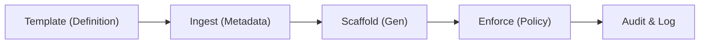

### 3. Distributed Project Topology
Strategically orchestrating standardized projects across global engineering teams, diverse tech stacks, and multi-cloud targets, providing a unified institutional view of global project health and engineering readiness.

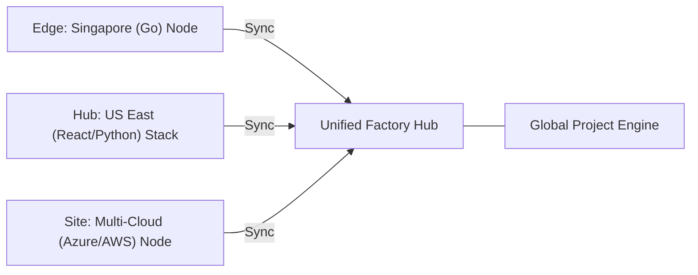

### 4. Template Governance & High-Trust Data Plane Protection Flow
Executing complex logic for securing the bridge between template authors and production codebases, ensuring every organizational identity is verified and every scaffolding access is according to institutional standards.

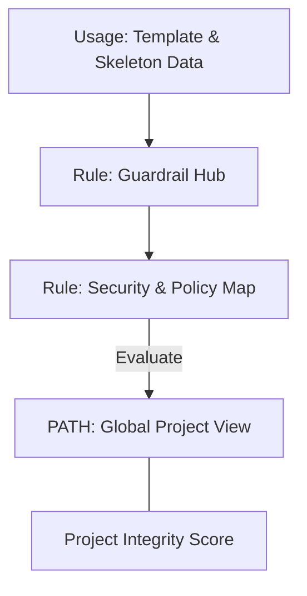

### 5. Multi-Stack Federation & Governance Flow
Automatically managing unified scaffolding standards across global regions and diverse developer portals, ensuring institutional data residency and security boundaries by default.

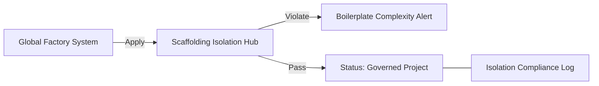

### 6. Encryption & Perimeter Protection Flow (Scaffolding Standard)
Managing the lifecycle of a scaffolding request, automatically enforcing institutional GPG signing and SBOM (Software Bill of Materials) standards as required by security policy, ensuring zero-latency security confidence.

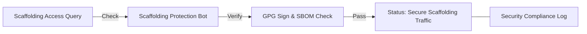

### 7. Institutional Scaffolding Maturity Scorecard
Grading organizational performance based on key indicators: Boilerplate Compliance Grade, Security Library Adoption Index, and CI/CD Readiness Index.

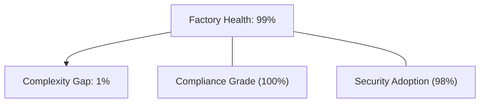

### 8. Identity & RBAC for Platform Governance
Managing fine-grained access to scaffolding hubs, provisioning workers, and audit logs between Platform Engineers, Developers, and Compliance Leads.

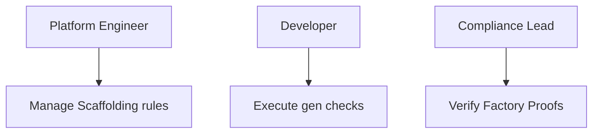

### 9. IaC Deployment: Enterprise-Scaffolder-as-Code Framework
Using modular Terraform to deploy and manage the versioned distribution of the project tracking hubs, policy protection workers, and forensic metadata lakes.

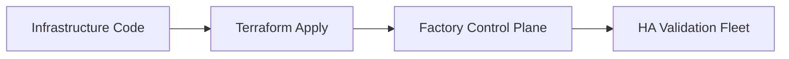

### 10. AIOps Scaffolding Drift & Risk Validation Flow
Using advanced analytics to identify sudden surges in template versions, unauthorized boilerplate changes, suspicious configuration drifts, or unusual project pattern changes that could result in institutional risk.

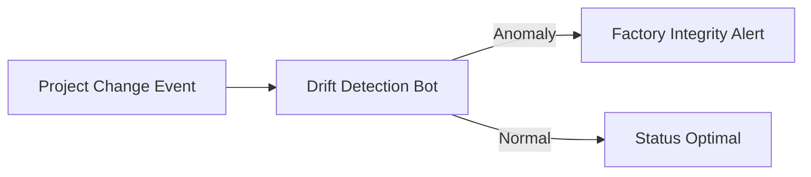

### 11. Metadata Lake for Forensic Scaffolding Audit
Storing long-term records of every project generated (metadata), every security event recorded, and every template version history for institutional record-keeping, compliance auditing, and post-provisioning forensics.

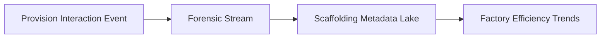

---

## 🏛️ Core Governance Pillars

1.  **Unified Foundation Coordination**: Maximizing resilience by centralizing all factory measurement through a single institutional plane.
2.  **Automated Project Provisioning**: Eliminating "manual boilerplate" scenarios through proactive orchestration and pattern verification.
3.  **Sequential Template Intelligence**: Ensuring zero-interruption operations through dependency-aware template-driven engineering.
4.  **Zero-Trust Guardrail Protection**: Automatically enforcing identity-based access and rule evaluation across all factory tiers.
5.  **Autonomous Operations Logic**: Guaranteeing reliability through automated industry-specific factory monitoring runbooks.
6.  **Full Scaffolding Auditability**: Immutable recording of every boilerplate change and project provision for institutional forensics.

---

## 🛠️ Technical Stack & Implementation

### Factory Engine & APIs
*   **Framework**: Python 3.11+ / FastAPI.
*   **Performance Engine**: Custom Python-based logic for multi-stack project provisioning and DORA-style velocity metrics.
*   **Integrations**: Native connectors for GitHub, GitLab, and Azure DevOps APIs.
*   **Persistence**: PostgreSQL (Factory Ledger) and Redis (Live Policy State).
*   **Auth Orchestrator**: Federated OIDC/SAML for least-privilege factory management access.

### Governance Dashboard (UI)
*   **Framework**: React 18 / Vite.
*   **Theme**: Dark, Slate, Indigo (Modern high-fidelity factory aesthetic).
*   **Visualization**: D3.js for project topologies and Recharts for velocity analytics.

### Infrastructure & DevOps
*   **Runtime**: AWS EKS or Azure Kubernetes Service (AKS) for management plane.
*   **Factory Hub**: Managed event sourcing for immutable factory security timeline reconstruction.
*   **IaC**: Modular Terraform for deploying the scaffolding landing zone and validation fleet.

---

## 🏗️ IaC Mapping (Module Structure)

| Module | Purpose | Real Services |
| :--- | :--- | :--- |
| **`infrastructure/factory_hub`** | Central management plane | EKS, PostgreSQL, Redis |
| **`infrastructure/enforcers`** | Distributed factory provisioners | Git, Cloud, Registry APIs |
| **`infrastructure/project_pipes`** | Factory Ingestion Hubs | Webhooks, Lambda |
| **`infrastructure/auditing`** | Forensic factory sinks | S3, Athena, Quicksight |

---

## 🚀 Deployment Guide

### Local Principal Environment
```bash
# Clone the landing zone platform
git clone https://github.com/devopstrio/enterprise-scaffolder.git
cd enterprise-scaffolder

# Configure environment
cp .env.example .env

# Launch the ES stack
make init

# Trigger a mock template update and automated guardrail validation simulation
make simulate-es
```

Access the Management Portal at `http://localhost:3000`.

---

## 📜 License
Distributed under the MIT License. See `LICENSE` for more information.

---
<div align="center">
  <p>© 2026 Devopstrio. All rights reserved.</p>
</div>
