<div align="center">


<h1>Enterprise Scaffolder</h1>

<p><strong>The Global Standard for Industrialized Software Scaffolding and Automated Software Factories</strong></p>

[]()
[]()
[]()
[]()

<br/>

> **"Industrializing software creation to unlock engineering velocity and secure defaults at institutional scale."** 
> Enterprise Scaffolder (ES) is a flagship repository designed to enable global organizations to design, deploy, and govern automated software factories through secure golden-path templates, automated service generation, and self-service infrastructure ecosystems.

</div>

---

## 🏛️ Executive Summary

**Enterprise Scaffolder (ES)** is a flagship repository designed for CIOs, CTOs, and Engineering Leaders. As organizations seek to standardize software delivery and reduce developer cognitive load, the need for an industrialized "Software Factory" becomes the critical path for productivity, security, and institutional compliance.

This platform provides an industrialized approach to **Software Scaffolding**, delivering production-ready **Template Engines**, **Golden Path Generators**, **Automated CI/CD Creation**, and **Self-Service Developer Portals**. It supports **Azure**, **AWS**, and **GCP**, enabling organizations to transition from "Hand-Crafted Code" to "Industrialized Software Generation."

---

## 💡 Why Enterprise Scaffolding Matters

An enterprise scaffolder is the "blueprint engine" for modern engineering organizations:
- **Accelerated Onboarding**: Reducing the time from "Idea to First Commit" from days to seconds through pre-approved templates.
- **Secure-by-Default**: Every generated service includes institutional security, logging, and observability from Day 1.
- **Consistency at Scale**: Ensuring thousands of microservices share a common structure, reducing cross-team friction and maintenance overhead.
- **Institutional Guardrails**: Automating the creation of repos, pipelines, and infrastructure that adhere to organizational standards.

---

## 🚀 Business Outcomes

### 🎯 Strategic Productivity Impact
- **Increased Engineering Throughput**: Reducing the foundational "plumbing" effort for every new project.
- **Improved Security Posture**: Eliminating misconfigurations by generating infrastructure and code from hardened blueprints.
- **Enhanced Developer Experience (DX)**: Providing elite tools that allow developers to focus on business logic rather than boilerplate.
- **Operational Standardization**: Unifying the delivery model across multi-cloud and hybrid estates through common scaffolding.

---

## 🏗️ Technical Stack

| Layer | Technology | Rationale |
|---|---|---|
| **Scaffolding Engine** | Python, Jinja2, Cookiecutter | High-performance, flexible template rendering for any language or framework. |
| **Control Plane** | FastAPI | High-performance API for template orchestration, generation history, and platform health. |
| **Frontend** | React 18, Vite | Premium portal for developer self-service, template catalogs, and productivity dashboards. |
| **Integrations** | GitHub, Backstage, Jenkins | Deep integration with the enterprise delivery ecosystem for automated repo and CI/CD creation. |
| **Database** | PostgreSQL | Centralized repository for template metadata, generation logs, and productivity analytics. |
| **Observability** | Prometheus / Grafana | Real-time monitoring of generation success, platform latency, and template adoption. |

---

## 📐 Architecture Storytelling: 85+ Diagrams

### 1. Executive High-Level Architecture
The holistic vision of the enterprise software factory journey.

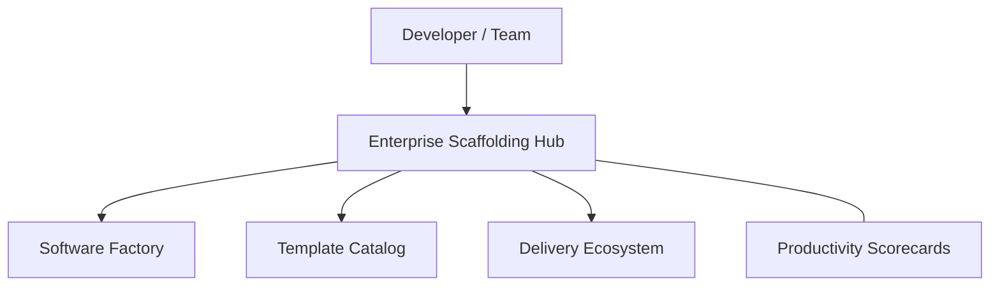

### 2. Detailed Platform Topology
The internal service boundaries and management layers of the industrialized scaffolder.

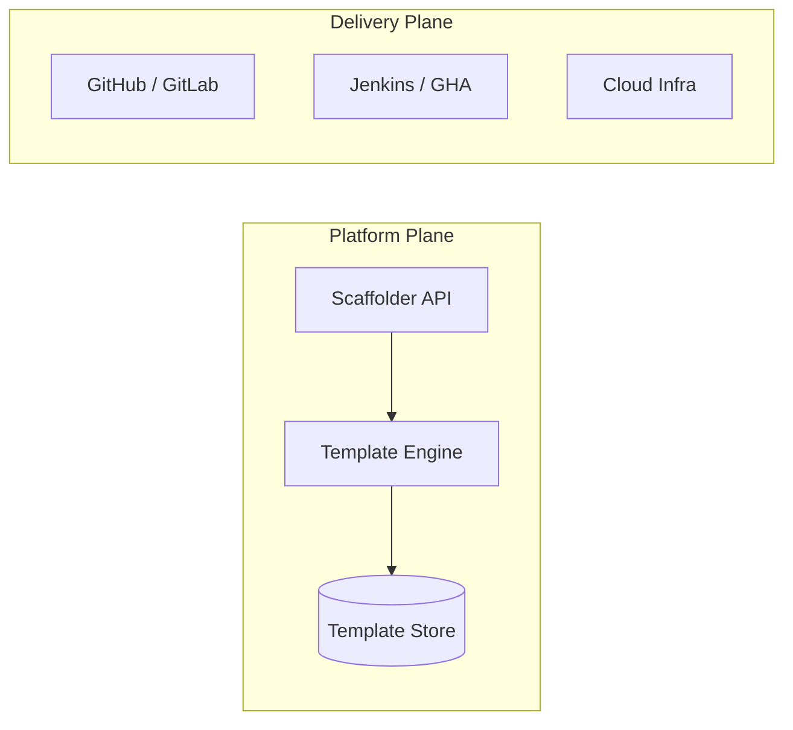

### 3. Developer Request to Repo Creation Path
Tracing the request from a developer's template selection to a fully provisioned repository.

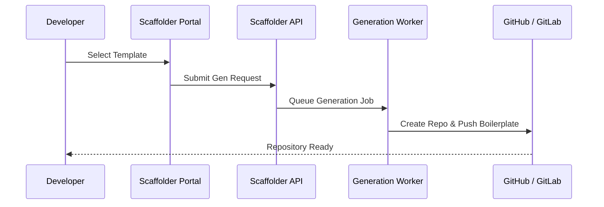

### 4. Control Plane Architecture
The "Brain" of the framework managing global institutional templates and generation history.

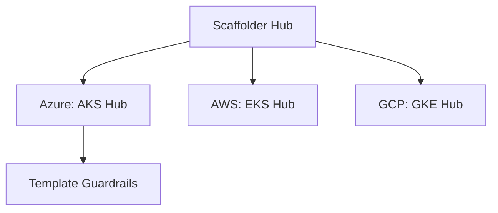

### 5. Multi-Cloud Topology
Synchronizing institutional scaffolding standards across Azure, AWS, and GCP.

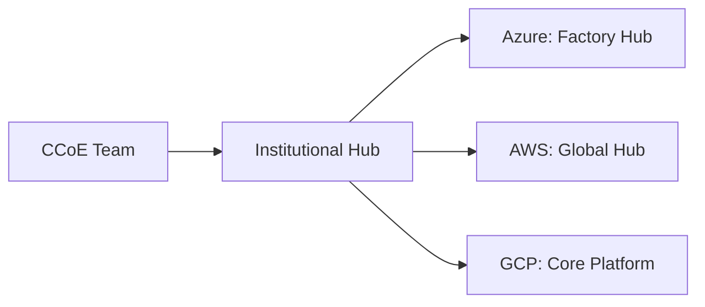

### 6. Regional Deployment Model
Hosting scaffolding services close to the engineering teams for low latency and high availability.

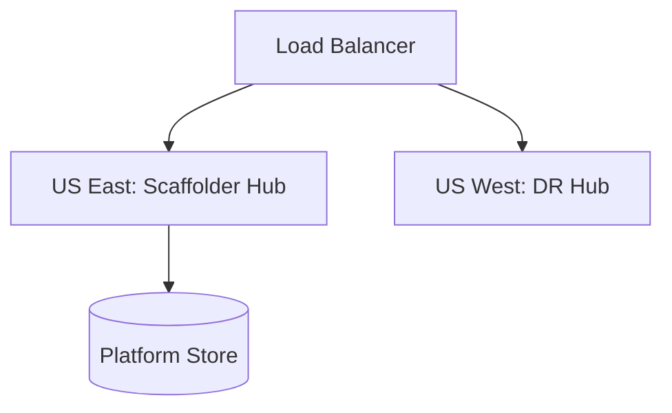

### 7. DR Failover Model
Ensuring platform continuity for critical scaffolding services and template metadata.

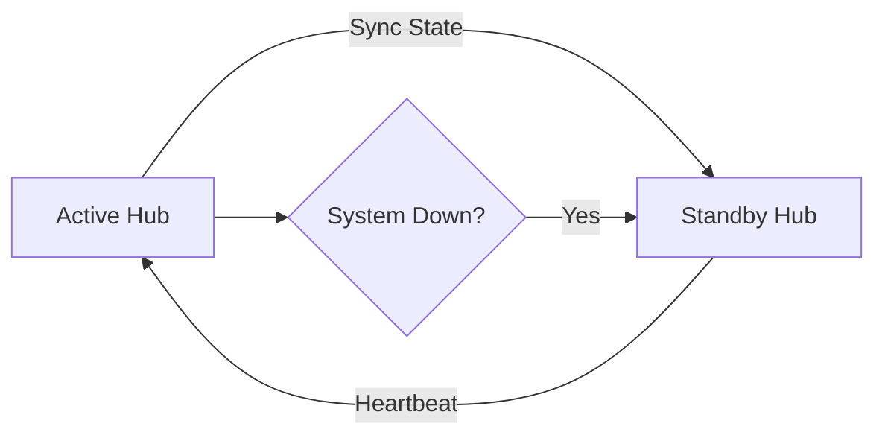

### 8. API Gateway Architecture
Securing and throttling the entry point for scaffolding orchestration and template access.

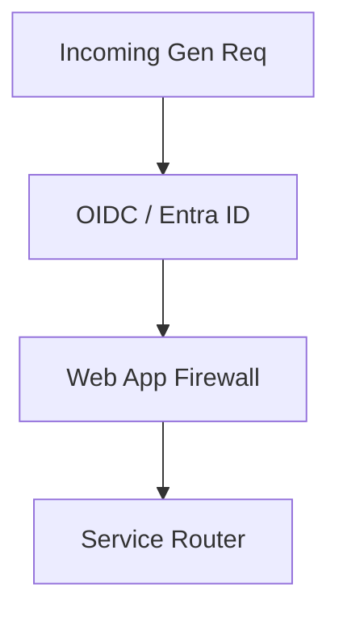

### 9. Queue Worker Architecture
Managing long-running generation, repo creation, and massive pipeline synchronization tasks.

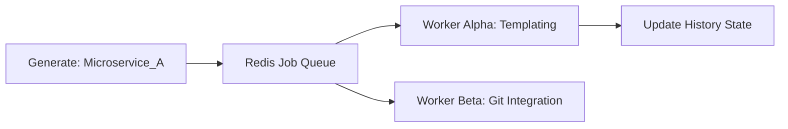

### 10. Dashboard Analytics Flow
How raw generation telemetry becomes executive institutional productivity scorecards.

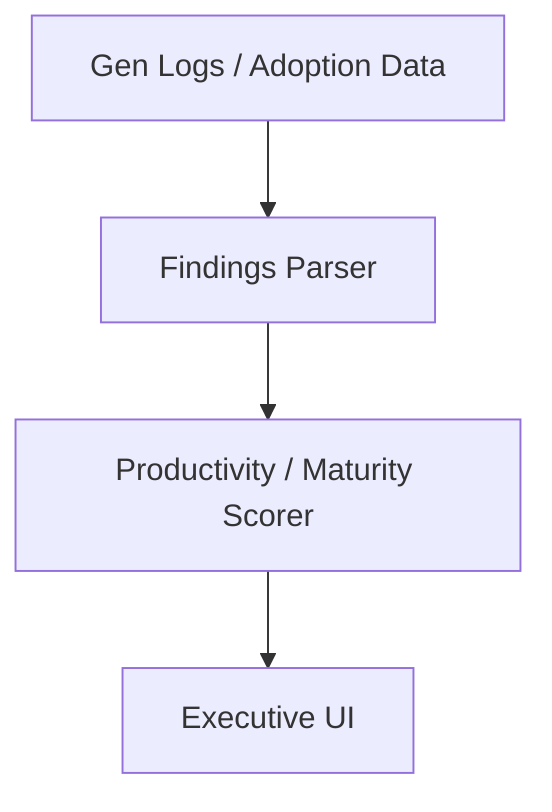

### 11. Template Catalog Model
Organizing institutional blueprints for rapid discovery and reuse.

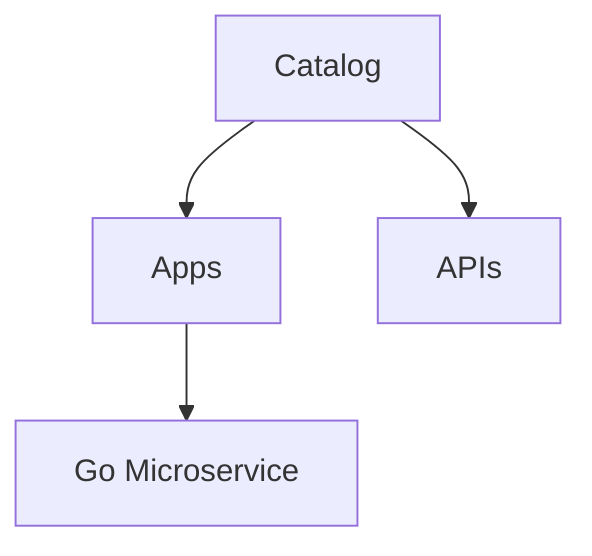

### 12. Golden Path Provisioning Flow
The industrialized path for delivering hardened, pre-approved software stacks.

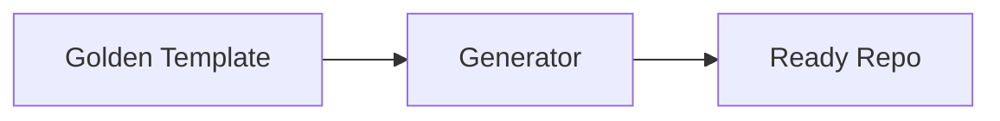

### 13. App Generator Workflow
Standardizing the creation of full-stack applications with secure defaults.

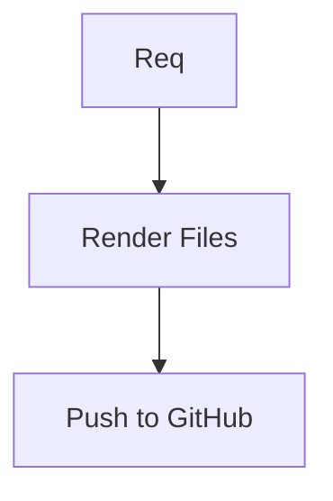

### 14. API Generator Lifecycle
Managing the end-to-end journey of an API from definition to live endpoint.

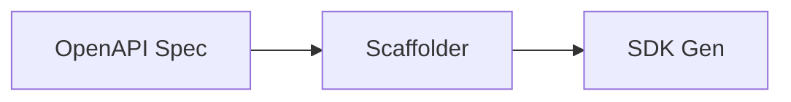

### 15. Microservice Scaffolding Flow
The automated journey for creating distributed microservices at scale.

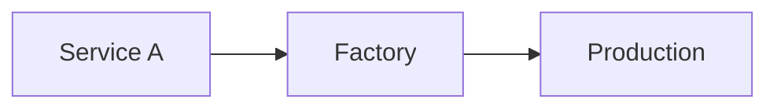

### 16. Monorepo Creation Model
Standardizing the structure and tooling for institutional monorepos.

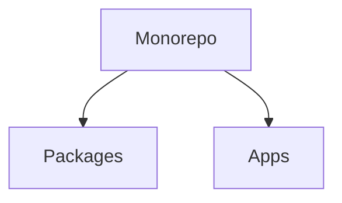

### 17. Polyrepo Generation Model
Automating the management of multiple interconnected microservice repos.

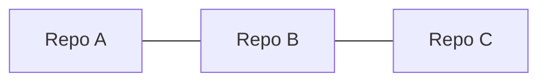

### 18. Data Product Generator Flow
Scaffolding standardized data pipelines, lakes, and analytical products.

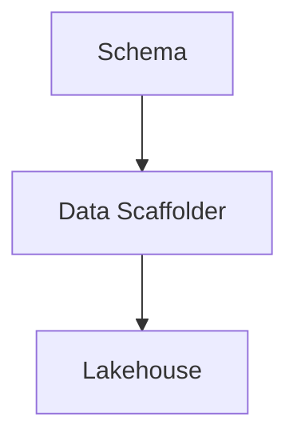

### 19. Infrastructure Template Lifecycle
Managing the versioning and promotion of institutional IaC blueprints.

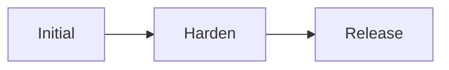

### 20. Pipeline Template Generation
Automating the creation of secure, governed CI/CD pipelines for every service.

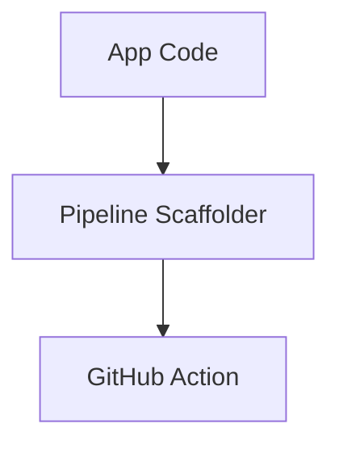

### 21. Self-Service Portal Workflow
The intuitive entry point for all engineering scaffolding tasks.

```mermaid
graph LR
    Dev[Developer] --> Portal[Factory Portal] --> Job[New Job]
```

### 22. Backstage Integration Model
Exposing the enterprise scaffolder as a first-class plugin in the IDP.

```mermaid
graph TD
    BS[Backstage] --> Scaf[Scaffolder Plugin] --> API[Core API]
```

### 23. Day-1 Onboarding Workflow
The industrialized path for getting a new engineer ready to code in minutes.

```mermaid
graph TD
    Hire[New Hire] --> Access[Access] --> Scaf[First Repo]
```

### 24. Inner Loop Development Model
Standardizing the tools and workflows for local development across the estate.

```mermaid
graph LR
    Code[Code] --> Dev[Dev Container] --> Test[Local Test]
```

### 25. Preview Environment Lifecycle
Automating the creation and cleanup of temporary environments for PR testing.

```mermaid
graph TD
    PR[PR Open] --> Create[Env] --> PR[PR Closed] --> Delete[Env]
```

### 26. Docs Portal Search Flow
Enabling developers to find platform blueprints through natural language.

```mermaid
graph LR
    Search[Search: Auth] --> Docs[Docs Hub] --> Result[Template]
```

### 27. CLI Scaffolder Workflow
Improving productivity through a high-performance command-line interface.

```mermaid
graph LR
    Cmd[es init] --> Engine[Factory Engine] --> Result[Success]
```

### 28. IDE Plugin Model
Integrating scaffolding capabilities directly into the developer's editor (VS Code / IntelliJ).

```mermaid
graph TD
    IDE[VS Code] --> Plug[ES Plugin] --> API[Control Plane]
```

### 29. Support Ticket Reduction Flow
Using automation to deflect routine project initialization requests.

```mermaid
graph TD
    Req[Project Req] --> Scaf[Self-Service] --> Ticket[Human Help]
```

### 30. Adoption Roadmap
Strategic phases for migrating the institutional workforce to the automated factory.

```mermaid
graph LR
    Pilot[Pilot] --> Scale[Global Rollout]
```

### 31. Commit to Deploy Workflow
Tracing the path of code from a local push to a production release.

```mermaid
graph LR
    Push[Push] --> Build[Build] --> Deploy[Deploy] --> Live[Live]
```

### 32. PR Validation Pipeline
Ensuring code quality and security before merging into the main branch.

```mermaid
graph TD
    PR[PR] --> Lint[Lint] --> Test[Test] --> Scan[Security]
```

### 33. Artifact Packaging Model
Standardizing how container images and binaries are versioned and stored.

```mermaid
graph LR
    Build[Build] --> Pack[OCI Image] --> Reg[Registry]
```

### 34. Versioning Lifecycle
Managing the semantic versioning and promotion of institutional templates.

```mermaid
graph LR
    Dev[v1.0.0-rc] --> Prod[v1.0.0]
```

### 35. Release Approval Flow
Automating the governance checks required for institutional template releases.

```mermaid
graph TD
    Rel[Release] --> Appr[Security Review] --> Live[Live Catalog]
```

### 36. GitOps Reconciliation Loop
The continuous process of syncing the live state with the desired Git state.

```mermaid
graph LR
    Git[Desired] <-> Sync[ArgoCD] <-> K8s[Live]
```

### 37. ArgoCD Sync Model
Managing multi-cluster template delivery through GitOps.

```mermaid
graph TD
    App[App Definition] --> Argo[ArgoCD] --> C1[Cluster A]
```

### 38. Blue/Green Deployment Workflow
Enabling zero-downtime releases through automated environment switching.

```mermaid
graph LR
    User[User] --> LB[Switch] --> Blue[Old]
    LB -.-> Green[New]
```

### 39. Canary Release Model
Gradually rolling out new template features to a small percentage of users.

```mermaid
graph TD
    Base[v1.0] --> Shift[Traffic Shift] --> Canary[v1.1: 5%]
```

### 40. Rollback Lifecycle
Automatically reverting to the last known good state when failures occur.

```mermaid
graph LR
    Fail[Failure] --> Trigger[Alert] --> Revert[Rollback]
```

### 41. Terraform Module Structure
Standardizing institutional infrastructure patterns for massive reuse.

```mermaid
graph TD
    Mod[Module] --> Net[Networking]
    Mod --> Comp[Compute]
```

### 42. Crossplane Provisioning Model
Managing cloud resources as native Kubernetes objects.

```mermaid
graph LR
    Claim[App Claim] --> Comp[Composition] --> Cloud[AWS/Azure/GCP]
```

### 43. Remote State Model
Securing the source of truth for global infrastructure configurations.

```mermaid
graph TD
    TF[Terraform] --> Store[S3 / Blob Storage]
```

### 44. Multi-Account Landing Zone
Providing secure, isolated environments for different business units.

```mermaid
graph LR
    Org[Org] --> Acc1[Shared Services]
    Org --> Acc2[Application Workloads]
```

### 45. Kubernetes Cluster Topology
The enterprise standard for secure, governed K8s platform hosting.

```mermaid
graph TD
    K8s[Cluster] --> Node[Node Pool] --> Pod[Workload]
```

### 46. Database Shared Service Model
Exposing managed databases (Postgres, SQL) to app teams via the factory.

```mermaid
graph TD
    Hub[DB Hub] --> Inst[App Instance]
```

### 47. Secrets Management Workflow
Securing application and platform credentials through centralized vaults.

```mermaid
graph TD
    App[App] --> Vault[Secret Vault]
```

### 48. Network Foundation Model
The secure-by-default hub-spoke topology used for all generated environments.

```mermaid
graph LR
    Hub[Hub] <-> Spoke1[VPC A]
```

### 49. Storage Provisioning Lifecycle
Governing the creation and lifecycle of object and block storage assets.

```mermaid
graph LR
    Policy[Policy] --> Store[Secure Bucket]
```

### 50. Drift Detection Workflow
Identifying and remediating manual changes to governed infrastructure.

```mermaid
graph TD
    Scan[Scan] --> Drift[Drift Detected] --> Fix[Auto-Remediate]
```

### 51. OIDC / SSO Auth Flow
Standardizing institutional access via Entra ID or Okta.

```mermaid
graph LR
    User[Dev] --> SSO[Institutional SSO] --> Portal[Scaffolder]
```

### 52. RBAC Model
Defining granular roles for Admins, Template Authors, and Developers.

```mermaid
graph TD
    Role[Contributor] --> Perm[Write Resources]
```

### 53. Secure SDLC Pipeline Model
Embedding security checks into every stage of the scaffolding lifecycle.

```mermaid
graph LR
    Plan[Plan] --> Scan[Scan] --> Build[Build] --> Audit[Audit]
```

### 54. Supply Chain Security Flow
Ensuring the integrity and provenance of all platform blueprints.

```mermaid
graph TD
    Src[Source] --> Sign[Sign Image] --> Verify[Verify at Runtime]
```

### 55. Vulnerability Remediation Cycle
Detecting and patching security risks in institutional templates.

```mermaid
graph TD
    Detect[Vuln Found] --> Ticket[Remediate] --> Verify[Verify]
```

### 56. Incident Response Workflow
Standardized steps for handling a global platform outage or breach.

```mermaid
graph TD
    Event[Event] --> Assess[Assess] --> Contain[Contain]
```

### 57. SLO / Uptime Model
Measuring the reliability of the software factory platform.

```mermaid
graph LR
    Target[SLO: 99.9%] <-> Actual[Status: 99.95%]
```

### 58. Metrics Pipeline
The journey of platform telemetry from generators to central dashboards.

```mermaid
graph TD
    App[App] --> Prom[Prometheus] --> Graf[Grafana]
```

### 59. Logging Architecture
The unified path for application and platform logs to central operations.

```mermaid
graph LR
    Log[Log] --> Fluent[Forwarder] --> Hub[Loki/Elastic]
```

### 60. Tracing Model
Observing distributed requests across complex platform mesh architectures.

```mermaid
graph TD
    User[User] --> S1[Service A] --> S2[Service B]
```

### 61. Executive KPI Review Cycle
Aligning software factory ROI with institutional business objectives.

```mermaid
graph TD
    Stats[Stats] --> Deck[Executive Summary]
```

### 62. Productivity Scorecard
Measuring the delivery efficiency and developer satisfaction of the estate.

```mermaid
graph LR
    LeadTime[Lead Time] --- DXIndex[DX Index]
```

### 63. Lead Time Workflow
Measuring and reducing the time from code commit to production release.

```mermaid
graph LR
    Commit[Commit] --> Pipeline[CI/CD] --> Prod[Production]
```

### 64. Cost Allocation Model
Linking scaffolding and infrastructure spend to specific cost centers.

```mermaid
graph LR
    Usage[Usage] --> Cost[Cloud Bill] --> Dept[Business Unit]
```

### 65. Capacity Planning Model
Predicting future platform needs based on historical growth trends.

```mermaid
graph TD
    Trend[Usage Trend] --> Forecast[Capacity Needs]
```

### 66. Team Benchmark Comparison
Benchmarking the efficiency and security of different engineering squads.

```mermaid
graph TD
    Rank[Ranking] --> Leaderboard[Leaderboard]
```

### 67. Quarterly Roadmap Cadence
Aligning platform evolution with the institutional business cycle.

```mermaid
graph TD
    Q1[Build] --> Q2[Scale]
```

### 68. Vendor Governance Workflow
Managing the lifecycle and security of third-party platform vendors.

```mermaid
graph LR
    Vendor[Vendor] --> Assess[Security Review] --> Auth[Approve]
```

### 69. Enterprise Maturity Roadmap
The multi-year journey to a fully industrialized software factory model.

```mermaid
graph LR
    S1[Ad-Hoc] --> S4[Autonomous]
```

### 70. Continuous Improvement Loop
The ultimate feedback cycle for platform excellence and developer joy.

```mermaid
graph LR
    Test[Test] --> Learn[Learn] --> Evolve[Evolve]
    Evolve --> Test
```

### 71. AI Template Recommendation Flow
Enabling developers to find the best blueprint via intelligent suggestions.

```mermaid
graph LR
    Input[Project Goal] --> AI[Recommender] --> Result[Best Template]
```

### 72. Policy-as-Code Governance
Enforcing institutional guardrails as versioned, testable code.

```mermaid
graph TD
    Rule[Code] --> Enforce[OPA / Kyverno]
```

### 73. Multi-country Operating Model
Governing global engineering teams under a single factory framework.

```mermaid
graph TD
    HQ[HQ] --> SiteA[US] --> SiteB[Singapore]
```

### 74. Regulated Workload Generator
Specialized scaffolding for banking, healthcare, or government apps.

```mermaid
graph TD
    Reg[HIPAA] --> Tpl[Regulated Template]
```

### 75. Hybrid Datacenter Extension
Extending the factory to legacy on-premise infrastructure.

```mermaid
graph LR
    Cloud[Cloud] <-> Hybrid[On-Prem K8s]
```

### 76. Edge Application Scaffolding
Managing workloads across distributed retail, factory, or edge sites.

```mermaid
graph TD
    Hub[Central Hub] --> Edge[Edge Nodes]
```

### 77. Data Platform Integration
Linking the software factory with enterprise data lakes and warehouses.

```mermaid
graph LR
    App[App] <-> Data[Lakehouse]
```

### 78. Identity Federation Model
Unifying platform access across multiple identity providers.

```mermaid
graph TD
    IDP[Institutional IDP] <-> Fed[Federated Hub]
```

### 79. M&A Onboarding workflow
Rapidly integrating and standardizing acquired engineering teams.

```mermaid
graph LR
    MA[M&A] --> Scan[Scan] --> Merge[Merge]
```

### 80. Innovation Portfolio Roadmap
Planning the next 36 months of institutional platform evolution.

```mermaid
graph TD
    Now[Now] --> Year3[AI-Native Factory]
```

### 81. Queue Processing Lifecycle
Ensuring reliable asynchronous generation at platform scale.

```mermaid
graph LR
    Push[Push] --> Q[Redis] --> Work[Worker]
```

### 82. Backup Recovery Model
Ensuring platform and blueprint durability across clouds.

```mermaid
graph TD
    Site[Active] --> Vault[Immutable Backup]
```

### 83. Change Management Workflow
Standardizing changes to core factory infrastructure and templates.

```mermaid
graph TD
    Req[Req] --> Review[Review] --> Execute[Approve]
```

### 84. Template Approval Process
The governance path for promoting a new blueprint to the global catalog.

```mermaid
graph LR
    Dev[Author] --> Sec[Security] --> Lead[CCoE Lead]
```

### 85. Repository Archival Lifecycle
Automating the retirement and cleanup of inactive engineering assets.

```mermaid
graph TD
    Idle[Inactive 90d] --> Notify[Notify Owner] --> Archive[Archive]
```

---

## 🔬 Software Factory Methodology

### 1. The Factory Pillars
Our platform is built on four core pillars:
- **Consistency**: Unified blueprints across all languages and clouds.
- **Security**: Zero-trust defaults and identity-first protection as the default.
- **Velocity**: Self-service automation to eliminate operational bottlenecks.
- **Transparency**: Clear visibility into productivity, compliance, and platform health.

### 2. Multi-Cloud Scaffolding
We provide an "Application Factory" model that ensures every new service is automatically hardened, connected to the hub network, and registered in the institutional catalog.

---

## 🚦 Getting Started

### 1. Prerequisites
- **Python** (v3.10+).
- **Docker** & **Kubernetes**.
- **Azure / AWS / GCP** administrative access.

### 2. Local Setup
```bash
# Clone the repository
git clone https://github.com/Devopstrio/enterprise-scaffolder.git
cd enterprise-scaffolder

# Start the Enterprise Factory Control Plane
docker-compose up --build
```
Access the Portal at `http://localhost:3000`.

---

## 🛡️ Governance & Security
- **Identity First**: Deep integration with Entra ID and OIDC for unified platform access.
- **Policy as Code**: Every template generation is validated against the Enterprise Security Policy.
- **FinOps**: Built-in cost attribution and departmental showback engines.

---
<sub>&copy; 2026 Devopstrio &mdash; Engineering the Future of Industrialized Software Delivery.</sub>
